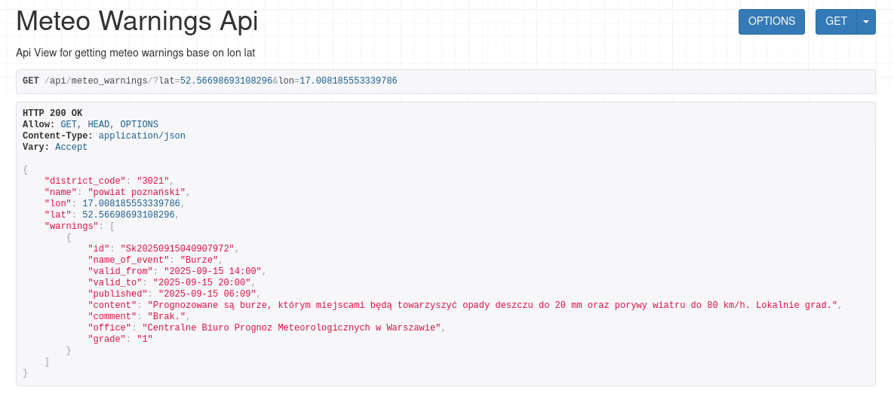
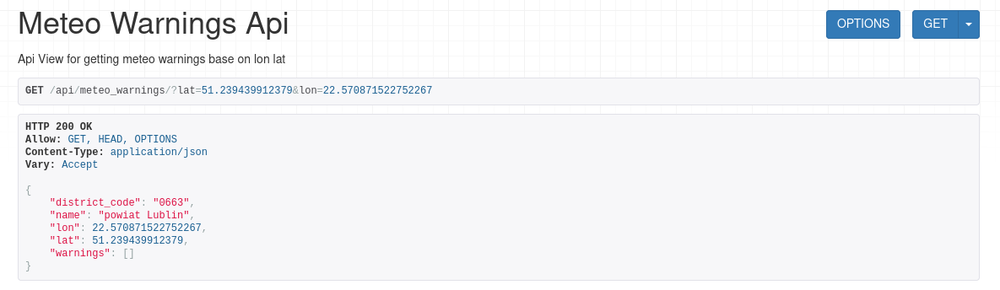
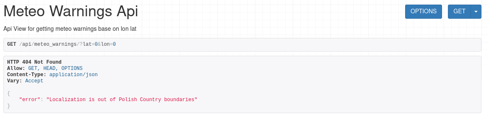

# Application Setup

## Prerequisites

Before running the application, make sure you have the following installed:

- [Git LFS](https://git-lfs.com/)  
- [Docker](https://docs.docker.com/get-docker/)  
- [Docker Compose](https://docs.docker.com/compose/install/)  

## Installation

1. **Initialize Git LFS**  
   Git LFS is required to download large files needed for the application to work correctly. Its only 60 mb file
   ```bash
   git lfs install
   
2. **Clone the repository**
   ```bash
   git clone git@github.com:m-lejwoda/recruitment_task.git
   cd recruitment_task
3. **Run application**
    ```bash
    docker-compose -f local.yml up --build
4. **Important commands**
   ```bash
   docker exec -it satagro_django python manage.py createupseruser
   docker exec -it satagro_django bash

## Logic behind
I downloaded and used the district file (`pgr.gml`), which contains the geometry of every district in Poland.  
I imported this data into my database. For each API request, I create a point based on the given latitude and longitude, and then check which district this point belongs to.

## How it works
I use **Celery** together with **Celery Beat** to schedule tasks:
1. **get_meteo_warnings**- runs every minute and checks whether the data in the database is up to date.  
2. **move_old_meteo_warnings_to_archive** - runs every hour and checks whether a meteo warning should be moved to the archive.
3. **generate_districts** - runs every time celery starts and checks a districts are currently in db if not script is adding files based on file `pgr.gml`

I use **PostGIS** plugin to store geometry of districts.

## Examples




